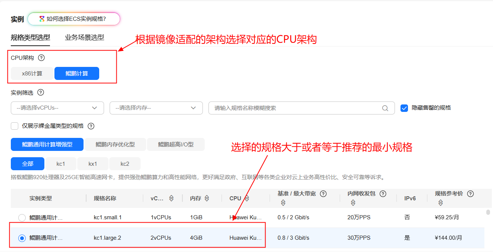
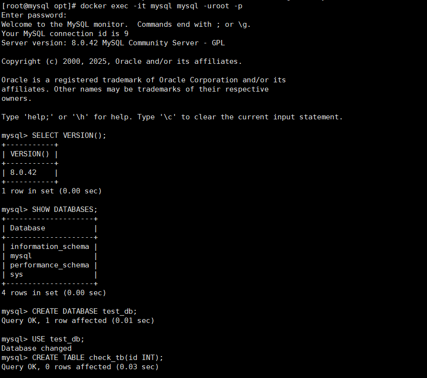

# Mysql数据库使用指南

# 一、商品链接

[Mysql数据库]()

# 二、商品说明

**Mysql** 是一种用于生成模拟数据库数据的工具。

# 三、商品购买示例

您可以在云商店搜索 **Mysql数据库*。

其中，地域、规格、推荐配置使用默认，购买方式根据您的需求选择按需/按月/按年，短期使用推荐按需，长期使用推荐按月/按年，确认配置后点击“立即购买”。

## 3.1、ECS控制台自定义购买示例

### 准备工作

在使用ECS控制台配置前，需要您提前配置好 **安全组规则**。

> **安全组规则的配置如下：**
* 入方向规则放通端口:3306，源地址内必须包含您的客户端ip，否则无法访问
* 入方向规则放通 CloudShell 连接实例使用的端口 `22`，以便在控制台登录调试
* 出方向规则一键放通

### 创建ECS

以购买“spark分布式计算引擎”做为示例，描述ECS控制台购买镜像商品全流程

前提工作准备好后，选择 ECS 控制台配置跳转到[购买ECS](https://support.huaweicloud.com/qs-ecs/ecs_01_0103.html) 页面，ECS 资源的配置如下图所示：

#### 选择CPU架构和规格

1.根据镜像所适配的架构选择对应的架构

2.选择的规格要大于或等于说明文档中提供的最小规格



#### 选择镜像

1.点击市场镜像，进入市场进行列表

2.选择需要购买的商品的规格镜像


#### 其他参数配置

1.其他参数根据实际情况进行填写

2.安全组选择提前配置好的安全组

3.配置完成之后点击立即购买即可


**值得注意的是：**

* VPC 您可以自行创建
* 安全组选择 [**准备工作**](#准备工作)中配置的安全组；
* 弹性公网IP选择现在购买，推荐选择“按流量计费”，带宽大小可设置为5Mbit/s；
* 高级配置需要在高级选项支持注入自定义数据，所以登录凭证不能选择“密码”，选择创建后设置；
* 其余默认或按规则填写即可。


# 四、商品使用

## 4.1 测试连通性

执行以下命令，连接mysql,密码123456
```bash
docker exec -it mysql mysql -uroot -p
```

操作数据库
```bash
CREATE DATABASE test_db;  -- 创建测试库
USE test_db;
CREATE TABLE check_tb(id INT);  -- 建表测试写入权限
INSERT INTO check_tb VALUES(1);  -- 数据写入测试
```



# 参考文档
[Mysql官网](https://github.com/emirozer/Mysql)
